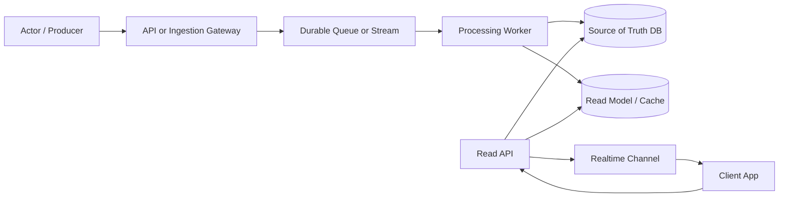
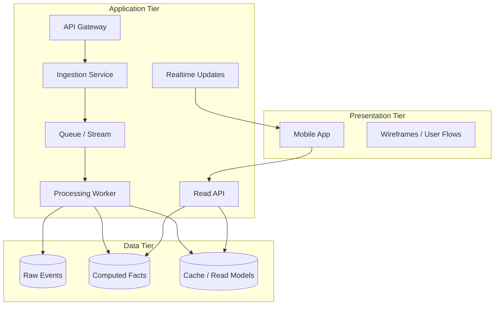
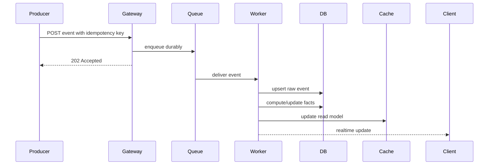
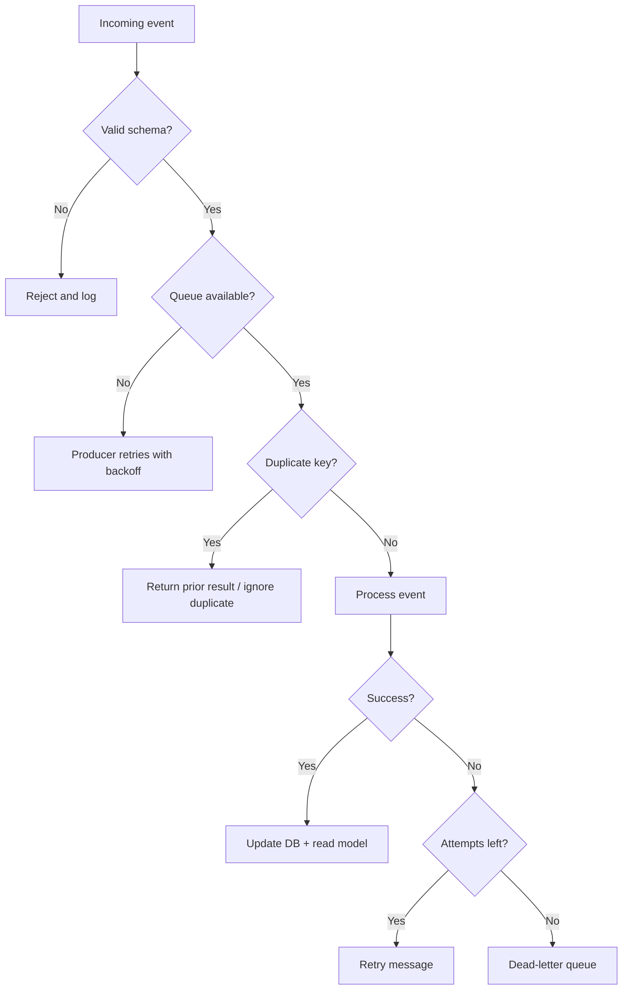
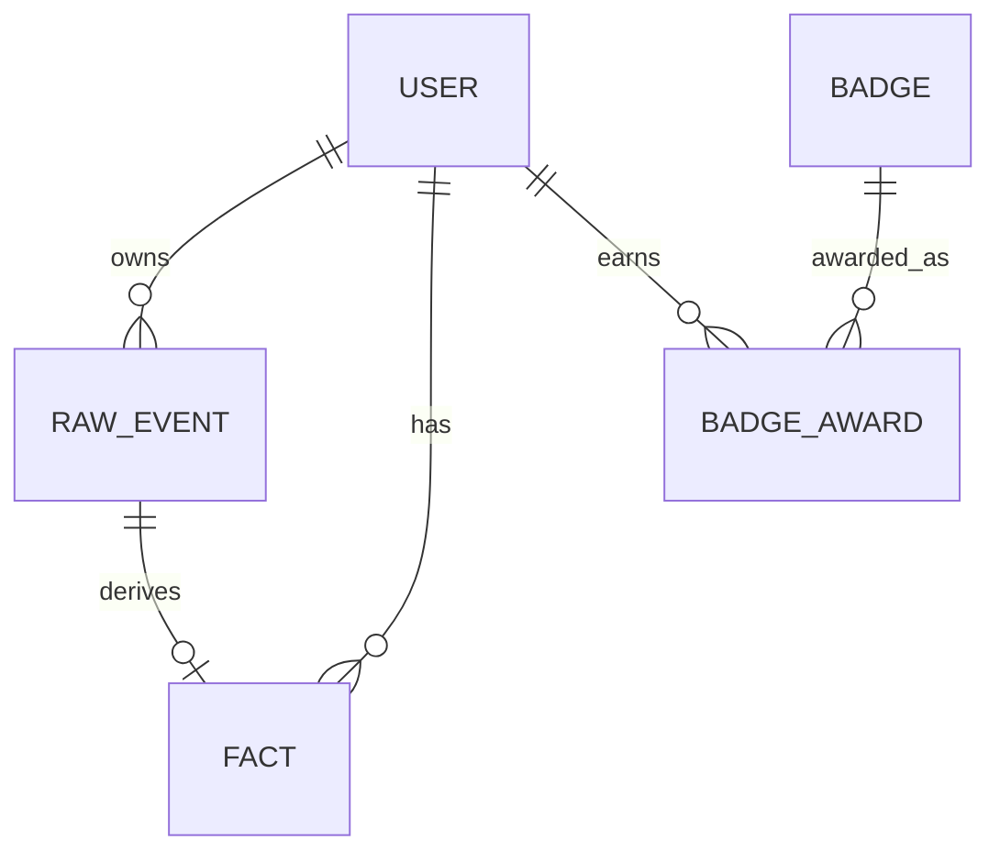

# Diagram Playbook

Use Mermaid by default for Markdown portability.

## Diagram Selection

Use:

- `flowchart LR` for architecture overview.
- `sequenceDiagram` for request/event timing.
- `erDiagram` for data model.
- `stateDiagram-v2` for lifecycle/status transitions.
- `C4-style containers` using Mermaid flowcharts when stakeholders need boundaries.

## Architecture Overview Template

## Three-Tier Template

## Event Flow Template

## Failure Flow Template

## ERD Template

## Diagram Rules

- Keep labels short.
- Put responsibilities in surrounding prose, not giant node text.
- Show source of truth separately from cache/read model.
- Show async boundary explicitly with a queue/stream node.
- Show failure/retry path when the requirement mentions reliability.
- Use subgraphs for tiers, trust boundaries, or ownership boundaries.
